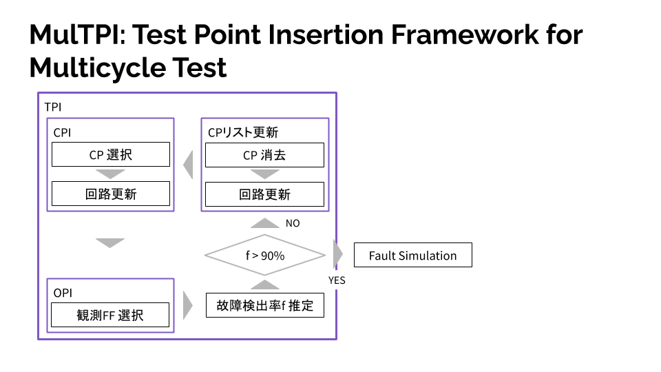

# Logic-BIST-Sim
simulation tool for Logic BIST

## About this branch
This branch is implemented by [@MaineK00n](https://github.com/MaineK00n) for the following flow.
After graduating from [@MaineK00n](https://github.com/MaineK00n), this repository may lose support or be deleted.
If you want to use the stable version, please use [ehimetakahashilab/Logic-BIST-Sim:master](https://github.com/ehimetakahashilab/Logic-BIST-Sim/tree/master).



## Runtime Environment
```console
$ gcc --version
gcc (Ubuntu 9.3.0-17ubuntu1~20.04) 9.3.0
Copyright (C) 2019 Free Software Foundation, Inc.
This is free software; see the source for copying conditions.  There is NO
warranty; not even for MERCHANTABILITY or FITNESS FOR A PARTICULAR PURPOSE.

$ make --version
GNU Make 4.2.1
Built for x86_64-pc-linux-gnu
Copyright (C) 1988-2016 Free Software Foundation, Inc.
License GPLv3+: GNU GPL version 3 or later <http://gnu.org/licenses/gpl.html>
This is free software: you are free to change and redistribute it.
There is NO WARRANTY, to the extent permitted by law.

$ bash --version
GNU bash, version 5.0.17(1)-release (x86_64-pc-linux-gnu)
Copyright (C) 2019 Free Software Foundation, Inc.
License GPLv3+: GNU GPL version 3 or later <http://gnu.org/licenses/gpl.html>

This is free software; you are free to change and redistribute it.
There is NO WARRANTY, to the extent permitted by law.
```

## Getting Started
```console
$ git clone -b customized-MaineK00n https://github.com/ehimetakahashilab/Logic-BIST-Sim
```

## How to Build
```console
$ pwd
/home/mainek00n/github/github.com/ehimetakahashilab/Logic-BIST-Sim

$ make
```

## Usage
### run_origin_circuit.sh
```console
$ run_origin_circuit.sh <CIRCUIT_PATH>

$ parallel --results OUTPUTS './run_origin_circuit.sh ../seq-benchmark/circuits/iscas89/{}' ::: s9234 s13207 s15850 s38417 s38584
```

### run_cp_op_circuit.sh
```console
$ run_cp_op_circuit.sh <CIRCUIT_PATH> <OP_PATH> <CP_PATH>

$ parallel --results OUTPUTS './run_cp_op_circuit.sh ../seq-benchmark/circuits/iscas89/{} ~/eval/lab/ff_eval/{}/FF_STATION/TOPSIS ~/eval/cplist/{}' ::: s9234 s13207 s15850 s38417 s38584
```

### src/tpg/tpg/lfsr
```console
$ lfsr <CIRCUIT_PATH> <TEST_VECTOR> <LFSR_CONFIG_PATH> <OUTPUT_PATH>
```

### src/tpg/tgp_TPI_gate/lfsr_gt
```console
$ lfsr_gt <CIRCUIT_PATH> <TEST_VECTOR> <LFSR_CONFIG_PATH> <LOGIC_CP_RATE> <CAPTURE> <OUTPUT_PATH>
```
